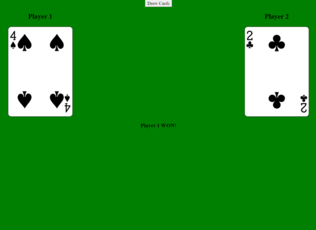

# War Card Game
A game called war where if the players draw the same card it leads to a duel.

**Link to project:** https://roaring-phoenix-6ff698.netlify.app/

## How It's Made:

**Tech used:** HTML, CSS, JavaScript, Cards API

Deck of Cards API is used to populate the cards using Fetch.

## Optimizations
10/17/22 - updated interface and added background change if both players draw the same card.

## Lessons Learned:

You can use APIs in your websites as a simple interface for something complex.

